# Walkthrough: GET / Latency Reduction

## Problem

Trace `213ca024acf42464db04e6adfff91910` showed a **4.42s** page load, with 86% (3.81s) spent in `getDailyState` executing 6 DB queries **sequentially**.

## Changes Made

### 1. [lib/prisma.ts](file:///Users/filipe/workspace/lotion/lotion-react/lib/prisma.ts) — Eager Connection

```diff:prisma.ts
import { PrismaClient } from '@prisma/client'

const globalForPrisma = globalThis as unknown as {
  prisma: PrismaClient | undefined
}

export const prisma = globalForPrisma.prisma ?? new PrismaClient()

if (process.env.NODE_ENV !== 'production') globalForPrisma.prisma = prisma
===
import { PrismaClient } from '@prisma/client'

const globalForPrisma = globalThis as unknown as {
  prisma: PrismaClient | undefined
}

function createPrismaClient() {
  const client = new PrismaClient()
  // Eagerly establish the connection so it's ready when the first query fires.
  // Without this, the first query pays ~500ms for the cold TCP/TLS handshake.
  client.$connect()
  return client
}

export const prisma = globalForPrisma.prisma ?? createPrismaClient()

if (process.env.NODE_ENV !== 'production') globalForPrisma.prisma = prisma
```

Calls `$connect()` when the PrismaClient singleton is created. On Vercel, this shifts the ~566ms TCP/TLS handshake to run in the background before any query needs it.

---

### 2. [actions.ts](file:///Users/filipe/workspace/lotion/lotion-react/app/actions.ts) — Query Parallelization

```diff:actions.ts
'use server'

import { prisma } from '@/lib/prisma'
import { revalidatePath } from 'next/cache'
import { auth } from '../auth'
import bcrypt from 'bcryptjs'
import { trace } from '@opentelemetry/api'

const tracer = trace.getTracer('lotion-actions')

// Ensure we have a DailyLog for the specific date
async function ensureDailyLog(date: string) {
    let dailyLog = await prisma.dailyLog.findUnique({
        where: { date },
    })
    if (!dailyLog) {
        dailyLog = await prisma.dailyLog.create({
            data: { date },
        })
    }
    return dailyLog
}

export async function getDailyState(date: string) {
    return tracer.startActiveSpan('getDailyState', async (span) => {
        try {
            span.setAttribute('date', date);
            return await _getDailyState(date);
        } finally {
            span.end();
        }
    });
}

async function _getDailyState(date: string) {
    const session = await auth()
    if (!session?.user) throw new Error('Unauthorized')

    const dailyLog = await ensureDailyLog(date)

    // Get all buckets
    const buckets = await prisma.bucket.findMany({
        orderBy: { order: 'asc' },
        include: {
            tasks: {
                orderBy: { order: 'asc' },
            },
        },
    })

    // Get assignments for this day
    const assignments = await prisma.assignment.findMany({
        where: { dailyLogId: dailyLog.id },
        include: {
            user: true,
            taskProgress: {
                include: {
                    completedBy: { select: { id: true, name: true } }
                }
            },
        },
    })

    // Get all users for the assignment dropdown
    const users = await prisma.user.findMany()

    // Find yesterday's missed tasks (simplified logic: check yesterday's log)
    // Calculate "yesterday" from "date"
    const d = new Date(date)
    d.setDate(d.getDate() - 1)
    const yesterdayDate = d.toISOString().split('T')[0]

    const yesterdayLog = await prisma.dailyLog.findUnique({
        where: { date: yesterdayDate },
        include: {
            assignments: {
                include: {
                    taskProgress: true
                }
            }
        }
    })

    const missedTaskIds: string[] = []
    if (yesterdayLog && yesterdayLog.assignments.length > 0) {
        // Optimize: Get all bucket tasks in one query instead of N queries
        const assignedBucketIds = yesterdayLog.assignments
            .filter(a => a.userId) // Only assigned buckets
            .map(a => a.bucketId)

        if (assignedBucketIds.length > 0) {
            const allBucketTasks = await prisma.taskDefinition.findMany({
                where: { bucketId: { in: assignedBucketIds } }
            })

            // Build a map for fast lookup
            const tasksByBucket = new Map<string, typeof allBucketTasks>()
            for (const task of allBucketTasks) {
                if (!tasksByBucket.has(task.bucketId)) {
                    tasksByBucket.set(task.bucketId, [])
                }
                tasksByBucket.get(task.bucketId)!.push(task)
            }

            // Check each assignment for incomplete tasks
            for (const assignment of yesterdayLog.assignments) {
                if (!assignment.userId) continue

                const bucketTasks = tasksByBucket.get(assignment.bucketId) || []
                for (const task of bucketTasks) {
                    const progress = assignment.taskProgress.find(p => p.taskDefinitionId === task.id)
                    if (!progress || progress.status !== 'DONE') {
                        missedTaskIds.push(task.id)
                    }
                }
            }
        }
    }

    return { dailyLog, buckets, assignments, users, missedTaskIds, currentUserRole: session.user.role, currentUserId: session.user.id }
}

export async function getOrCreateAssignment(bucketId: string, date: string): Promise<string> {
    const session = await auth()
    if (!session?.user) throw new Error('Unauthorized')

    const dailyLog = await ensureDailyLog(date)

    const existing = await prisma.assignment.findUnique({
        where: { dailyLogId_bucketId: { dailyLogId: dailyLog.id, bucketId } }
    })
    if (existing) return existing.id

    const created = await prisma.assignment.create({
        data: { dailyLogId: dailyLog.id, bucketId, userId: null }
    })
    return created.id
}

export async function assignBucket(bucketId: string, userId: string, date: string) {
    return tracer.startActiveSpan('assignBucket', async (span) => {
        try {
            span.setAttribute('bucketId', bucketId);
            span.setAttribute('userId', userId);
            span.setAttribute('date', date);
            return await _assignBucket(bucketId, userId, date);
        } finally {
            span.end();
        }
    });
}

async function _assignBucket(bucketId: string, userId: string, date: string) {
    const session = await auth()
    if (!session?.user) throw new Error('Unauthorized')

    const dailyLog = await ensureDailyLog(date)

    // Convert empty string to null for unassignment
    const userIdValue = userId === '' ? null : userId

    const existing = await prisma.assignment.findUnique({
        where: {
            dailyLogId_bucketId: {
                dailyLogId: dailyLog.id,
                bucketId,
            }
        }
    })

    if (existing) {
        await prisma.assignment.update({
            where: { id: existing.id },
            data: { userId: userIdValue },
        })
    } else {
        await prisma.assignment.create({
            data: {
                dailyLogId: dailyLog.id,
                bucketId,
                userId: userIdValue,
            },
        })
    }

    revalidatePath('/')
}

export async function toggleTask(
    assignmentId: string,
    taskDefinitionId: string,
    isDone: boolean
) {
    const session = await auth()
    if (!session?.user) throw new Error('Unauthorized')

    // Find assignment to see who it belongs to
    const assignment = await prisma.assignment.findUnique({
        where: { id: assignmentId }
    })

    // Determine if the logged-in user is supporting someone else
    const isSupporter = assignment?.userId && session.user.id !== assignment.userId;
    const computedSupporterId = isSupporter ? session.user.id : null;

    // Check if progress entry exists
    const existing = await prisma.taskProgress.findUnique({
        where: {
            assignmentId_taskDefinitionId: {
                assignmentId,
                taskDefinitionId
            }
        }
    })

    let progress
    if (existing) {
        progress = await prisma.taskProgress.update({
            where: { id: existing.id },
            data: {
                status: isDone ? 'DONE' : 'PENDING',
                completedAt: isDone ? new Date() : null,
                supportedByUserId: isDone ? computedSupporterId : null,
                completedByUserId: isDone ? session.user.id : null,
            }
        })
    } else {
        progress = await prisma.taskProgress.create({
            data: {
                assignmentId,
                taskDefinitionId,
                status: isDone ? 'DONE' : 'PENDING',
                completedAt: isDone ? new Date() : null,
                supportedByUserId: isDone ? computedSupporterId : null,
                completedByUserId: isDone ? session.user.id : null,
            }
        })
    }

    await prisma.taskEvent.create({
        data: {
            taskProgressId: progress.id,
            userId: session.user.id,
            action: isDone ? 'COMPLETED' : 'UNCOMPLETED',
        }
    })

    revalidatePath('/')
}

// Phase 2: Edit actions
export async function updateBucket(bucketId: string, title: string) {
    const session = await auth()
    if (!session?.user) throw new Error('Unauthorized')

    await prisma.bucket.update({
        where: { id: bucketId },
        data: { title }
    })
    revalidatePath('/')
}

export async function createTaskDefinition(bucketId: string, content: string) {
    const session = await auth()
    if (!session?.user) throw new Error('Unauthorized')

    // Get max order
    const lastTask = await prisma.taskDefinition.findFirst({
        where: { bucketId },
        orderBy: { order: 'desc' }
    })
    const order = (lastTask?.order || 0) + 1

    await prisma.taskDefinition.create({
        data: {
            bucketId,
            content,
            order
        }
    })
    revalidatePath('/')
}

export async function updateTaskDefinition(taskId: string, content: string) {
    const session = await auth()
    if (!session?.user) throw new Error('Unauthorized')

    await prisma.taskDefinition.update({
        where: { id: taskId },
        data: { content }
    })
    revalidatePath('/')
}

export async function deleteTaskDefinition(taskId: string) {
    const session = await auth()
    if (!session?.user) throw new Error('Unauthorized')

    // Clean up valid progress first
    await prisma.taskProgress.deleteMany({
        where: { taskDefinitionId: taskId }
    })

    await prisma.taskDefinition.delete({
        where: { id: taskId }
    })
    revalidatePath('/')
}

// Phase 3: User Management
export async function createUser(data: { name: string, email: string, password: string, role?: string }) {
    const session = await auth()
    if (!session?.user) throw new Error('Unauthorized')

    // Only admins can create users
    if (session.user.role !== 'ADMIN') {
        throw new Error('Only administrators can create users')
    }

    const hashedPassword = await bcrypt.hash(data.password, 10)

    await prisma.user.create({
        data: {
            name: data.name,
            email: data.email,
            password: hashedPassword,
            role: data.role || 'MEMBER'
        }
    })
    revalidatePath('/')
}

export async function updateUser(id: string, name: string) {
    const session = await auth()
    if (!session?.user) throw new Error('Unauthorized')

    await prisma.user.update({
        where: { id },
        data: { name }
    })
    revalidatePath('/')
}

export async function deleteUser(id: string) {
    const session = await auth()
    if (!session?.user) throw new Error('Unauthorized')

    // Unassign pending assignments
    await prisma.assignment.updateMany({
        where: { userId: id },
        data: { userId: null }
    })

    // Clear supported tasks
    await prisma.taskProgress.updateMany({
        where: { supportedByUserId: id },
        data: { supportedByUserId: null }
    })

    await prisma.user.delete({
        where: { id }
    })
    revalidatePath('/')
}

export async function getTaskHistory(taskDefinitionId: string) {
    const session = await auth()
    if (!session?.user) throw new Error('Unauthorized')

    return prisma.taskEvent.findMany({
        where: {
            taskProgress: { taskDefinitionId }
        },
        include: {
            user: { select: { id: true, name: true } },
            taskProgress: {
                include: {
                    taskDefinition: { select: { content: true } }
                }
            }
        },
        orderBy: { createdAt: 'desc' },
    })
}

export async function createBucket(title: string): Promise<void> {
    const session = await auth()
    if (!session?.user) throw new Error('Unauthorized')

    const lastBucket = await prisma.bucket.findFirst({ orderBy: { order: 'desc' } })
    await prisma.bucket.create({
        data: { title, order: (lastBucket?.order ?? 0) + 1, color: 'gray' }
    })
    revalidatePath('/')
}

export async function deleteBucket(bucketId: string): Promise<void> {
    const session = await auth()
    if (!session?.user) throw new Error('Unauthorized')

    // Find or create an "Unassigned" bucket to receive orphaned tasks
    let unassignedBucket = await prisma.bucket.findFirst({
        where: { title: 'Unassigned', id: { not: bucketId } }
    })
    if (!unassignedBucket) {
        const lastBucket = await prisma.bucket.findFirst({
            where: { id: { not: bucketId } },
            orderBy: { order: 'desc' }
        })
        unassignedBucket = await prisma.bucket.create({
            data: { title: 'Unassigned', order: (lastBucket?.order ?? 0) + 1, color: 'gray' }
        })
    }

    // Clean up historical assignment data for this bucket
    const assignments = await prisma.assignment.findMany({
        where: { bucketId },
        select: { id: true }
    })
    if (assignments.length > 0) {
        const assignmentIds = assignments.map(a => a.id)
        const progressRecords = await prisma.taskProgress.findMany({
            where: { assignmentId: { in: assignmentIds } },
            select: { id: true }
        })
        if (progressRecords.length > 0) {
            const progressIds = progressRecords.map(p => p.id)
            await prisma.taskEvent.deleteMany({ where: { taskProgressId: { in: progressIds } } })
            await prisma.taskProgress.deleteMany({ where: { id: { in: progressIds } } })
        }
        await prisma.assignment.deleteMany({ where: { bucketId } })
    }

    // Move task definitions to the Unassigned bucket
    const lastTaskInTarget = await prisma.taskDefinition.findFirst({
        where: { bucketId: unassignedBucket.id },
        orderBy: { order: 'desc' }
    })
    const tasksToMove = await prisma.taskDefinition.findMany({
        where: { bucketId },
        orderBy: { order: 'asc' }
    })
    let nextOrder = (lastTaskInTarget?.order ?? 0) + 1
    for (const task of tasksToMove) {
        await prisma.taskDefinition.update({
            where: { id: task.id },
            data: { bucketId: unassignedBucket.id, order: nextOrder++ }
        })
    }

    await prisma.bucket.delete({ where: { id: bucketId } })
    revalidatePath('/')
}

export async function reorderTasks(bucketId: string, taskIds: string[]): Promise<void> {
    const session = await auth()
    if (!session?.user) throw new Error('Unauthorized')

    await prisma.$transaction(
        taskIds.map((id, index) =>
            prisma.taskDefinition.update({
                where: { id },
                data: { order: index + 1 }
            })
        )
    )
    revalidatePath('/')
}

export async function getDatesWithData(): Promise<string[]> {
    const session = await auth()
    if (!session?.user) throw new Error('Unauthorized')

    const logs = await prisma.dailyLog.findMany({
        where: {
            assignments: {
                some: { userId: { not: null } }
            }
        },
        select: { date: true },
        orderBy: { date: 'asc' },
    })

    return logs.map(l => l.date)
}

type DailyReportData = {
    date: string
    summary: {
        totalBuckets: number
        assignedBuckets: number
        unassignedBuckets: number
        totalTasks: number
        completedTasks: number
        outstandingTasks: number
        completionPercent: number
    }
    assignments: Array<{
        user: { id: string; name: string }
        bucket: { id: string; title: string; icon: string | null; color: string }
        completed: Array<{
            taskId: string
            content: string
            completedAt: Date | null
            completedBy: { id: string; name: string } | null
            supportedBy: { id: string; name: string } | null
        }>
        outstanding: Array<{
            taskId: string
            content: string
        }>
    }>
    unassignedBuckets: Array<{
        id: string
        title: string
        icon: string | null
        color: string
        completed: Array<{
            taskId: string
            content: string
            completedAt: Date | null
            completedBy: { id: string; name: string } | null
            supportedBy: { id: string; name: string } | null
        }>
        outstanding: Array<{
            taskId: string
            content: string
        }>
    }>
}

export async function getDailyReport(date: string): Promise<DailyReportData> {
    const session = await auth()
    if (!session?.user) throw new Error('Unauthorized')
    if (session.user.role !== 'ADMIN') throw new Error('Forbidden')

    const dailyLog = await prisma.dailyLog.findUnique({
        where: { date },
    })

    const buckets = await prisma.bucket.findMany({
        orderBy: { order: 'asc' },
        include: {
            tasks: { orderBy: { order: 'asc' } },
        },
    })

    const dbAssignments = dailyLog
        ? await prisma.assignment.findMany({
            where: { dailyLogId: dailyLog.id },
            include: {
                user: true,
                bucket: true,
                taskProgress: {
                    include: {
                        completedBy: { select: { id: true, name: true } },
                        supportedBy: { select: { id: true, name: true } },
                    },
                },
            },
        })
        : []

    // Build assignments array (only assigned ones)
    const assignedBucketIds = new Set<string>()
    const assignments: DailyReportData['assignments'] = []

    for (const a of dbAssignments) {
        if (!a.userId || !a.user) continue
        assignedBucketIds.add(a.bucketId)

        const bucket = buckets.find(b => b.id === a.bucketId)
        if (!bucket) continue

        const completed: DailyReportData['assignments'][0]['completed'] = []
        const outstanding: DailyReportData['assignments'][0]['outstanding'] = []

        for (const task of bucket.tasks) {
            const progress = a.taskProgress.find(p => p.taskDefinitionId === task.id)
            if (progress && progress.status === 'DONE') {
                completed.push({
                    taskId: task.id,
                    content: task.content,
                    completedAt: progress.completedAt,
                    completedBy: progress.completedBy ?? null,
                    supportedBy: progress.supportedBy ?? null,
                })
            } else {
                outstanding.push({ taskId: task.id, content: task.content })
            }
        }

        assignments.push({
            user: { id: a.user.id, name: a.user.name },
            bucket: {
                id: a.bucket.id,
                title: a.bucket.title,
                icon: a.bucket.icon,
                color: a.bucket.color,
            },
            completed,
            outstanding,
        })
    }

    // Unassigned buckets
    const unassignedBuckets: DailyReportData['unassignedBuckets'] = buckets
        .filter(b => !assignedBucketIds.has(b.id))
        .map(b => {
            const completed: DailyReportData['unassignedBuckets'][0]['completed'] = []
            const outstanding: DailyReportData['unassignedBuckets'][0]['outstanding'] = []
            
            const assignment = dbAssignments.find(a => a.bucketId === b.id)

            for (const task of b.tasks) {
                const progress = assignment?.taskProgress.find(p => p.taskDefinitionId === task.id)
                if (progress && progress.status === 'DONE') {
                    completed.push({
                        taskId: task.id,
                        content: task.content,
                        completedAt: progress.completedAt,
                        completedBy: progress.completedBy ?? null,
                        supportedBy: progress.supportedBy ?? null,
                    })
                } else {
                    outstanding.push({ taskId: task.id, content: task.content })
                }
            }

            return {
                id: b.id,
                title: b.title,
                icon: b.icon,
                color: b.color,
                completed,
                outstanding,
            }
        })

    // Summary — count all tasks across assigned and unassigned buckets
    const totalBuckets = buckets.length
    const assignedBucketsCount = assignments.length
    const assignedTasksTotal = assignments.reduce((s, a) => s + a.completed.length + a.outstanding.length, 0)
    const unassignedTasksTotal = unassignedBuckets.reduce((s, b) => s + b.completed.length + b.outstanding.length, 0)
    const totalTasks = assignedTasksTotal + unassignedTasksTotal
    const completedTasks = assignments.reduce((s, a) => s + a.completed.length, 0) + unassignedBuckets.reduce((s, b) => s + b.completed.length, 0)
    const outstandingTasks = totalTasks - completedTasks
    const completionPercent = totalTasks > 0 ? Math.round((completedTasks / totalTasks) * 1000) / 10 : 0

    return {
        date,
        summary: {
            totalBuckets,
            assignedBuckets: assignedBucketsCount,
            unassignedBuckets: totalBuckets - assignedBucketsCount,
            totalTasks,
            completedTasks,
            outstandingTasks,
            completionPercent,
        },
        assignments,
        unassignedBuckets,
    }
}
===
'use server'

import { prisma } from '@/lib/prisma'
import { revalidatePath } from 'next/cache'
import { auth } from '../auth'
import bcrypt from 'bcryptjs'
import { trace } from '@opentelemetry/api'

const tracer = trace.getTracer('lotion-actions')

// Ensure we have a DailyLog for the specific date
async function ensureDailyLog(date: string) {
    let dailyLog = await prisma.dailyLog.findUnique({
        where: { date },
    })
    if (!dailyLog) {
        dailyLog = await prisma.dailyLog.create({
            data: { date },
        })
    }
    return dailyLog
}

export async function getDailyState(date: string) {
    return tracer.startActiveSpan('getDailyState', async (span) => {
        try {
            span.setAttribute('date', date);
            return await _getDailyState(date);
        } finally {
            span.end();
        }
    });
}

async function _getDailyState(date: string) {
    const session = await auth()
    if (!session?.user) throw new Error('Unauthorized')

    // Calculate yesterday's date for missed-task detection
    const d = new Date(date)
    d.setDate(d.getDate() - 1)
    const yesterdayDate = d.toISOString().split('T')[0]

    // --- Parallel batch 1: all independent queries ---
    const [dailyLog, buckets, users, yesterdayLog, datesWithData] = await Promise.all([
        // 1. Ensure today's DailyLog exists
        ensureDailyLog(date),
        // 2. All buckets + their task definitions
        prisma.bucket.findMany({
            orderBy: { order: 'asc' },
            include: {
                tasks: {
                    orderBy: { order: 'asc' },
                },
            },
        }),
        // 3. All users for the assignment dropdown
        prisma.user.findMany(),
        // 4. Yesterday's log with assignments + progress (for missed tasks)
        prisma.dailyLog.findUnique({
            where: { date: yesterdayDate },
            include: {
                assignments: {
                    include: {
                        taskProgress: true
                    }
                }
            }
        }),
        // 5. Dates that have assignment data (for DateFilter)
        prisma.dailyLog.findMany({
            where: {
                assignments: {
                    some: { userId: { not: null } }
                }
            },
            select: { date: true },
            orderBy: { date: 'asc' },
        }),
    ])

    // --- Parallel batch 2: queries that depend on dailyLog.id ---
    const [assignments, missedTaskDefinitions] = await Promise.all([
        // Assignments for today
        prisma.assignment.findMany({
            where: { dailyLogId: dailyLog.id },
            include: {
                user: true,
                taskProgress: {
                    include: {
                        completedBy: { select: { id: true, name: true } }
                    }
                },
            },
        }),
        // Missed tasks: fetch task definitions for yesterday's assigned buckets
        (async () => {
            if (!yesterdayLog || yesterdayLog.assignments.length === 0) return []
            const assignedBucketIds = yesterdayLog.assignments
                .filter(a => a.userId)
                .map(a => a.bucketId)
            if (assignedBucketIds.length === 0) return []
            return prisma.taskDefinition.findMany({
                where: { bucketId: { in: assignedBucketIds } }
            })
        })(),
    ])

    // Compute missed task IDs from yesterday's data
    const missedTaskIds: string[] = []
    if (yesterdayLog && yesterdayLog.assignments.length > 0) {
        const tasksByBucket = new Map<string, typeof missedTaskDefinitions>()
        for (const task of missedTaskDefinitions) {
            if (!tasksByBucket.has(task.bucketId)) {
                tasksByBucket.set(task.bucketId, [])
            }
            tasksByBucket.get(task.bucketId)!.push(task)
        }

        for (const assignment of yesterdayLog.assignments) {
            if (!assignment.userId) continue
            const bucketTasks = tasksByBucket.get(assignment.bucketId) || []
            for (const task of bucketTasks) {
                const progress = assignment.taskProgress.find(p => p.taskDefinitionId === task.id)
                if (!progress || progress.status !== 'DONE') {
                    missedTaskIds.push(task.id)
                }
            }
        }
    }

    return {
        dailyLog,
        buckets,
        assignments,
        users,
        missedTaskIds,
        currentUserRole: session.user.role,
        currentUserId: session.user.id,
        datesWithData: datesWithData.map(l => l.date),
    }
}

export async function getOrCreateAssignment(bucketId: string, date: string): Promise<string> {
    const session = await auth()
    if (!session?.user) throw new Error('Unauthorized')

    const dailyLog = await ensureDailyLog(date)

    const existing = await prisma.assignment.findUnique({
        where: { dailyLogId_bucketId: { dailyLogId: dailyLog.id, bucketId } }
    })
    if (existing) return existing.id

    const created = await prisma.assignment.create({
        data: { dailyLogId: dailyLog.id, bucketId, userId: null }
    })
    return created.id
}

export async function assignBucket(bucketId: string, userId: string, date: string) {
    return tracer.startActiveSpan('assignBucket', async (span) => {
        try {
            span.setAttribute('bucketId', bucketId);
            span.setAttribute('userId', userId);
            span.setAttribute('date', date);
            return await _assignBucket(bucketId, userId, date);
        } finally {
            span.end();
        }
    });
}

async function _assignBucket(bucketId: string, userId: string, date: string) {
    const session = await auth()
    if (!session?.user) throw new Error('Unauthorized')

    const dailyLog = await ensureDailyLog(date)

    // Convert empty string to null for unassignment
    const userIdValue = userId === '' ? null : userId

    const existing = await prisma.assignment.findUnique({
        where: {
            dailyLogId_bucketId: {
                dailyLogId: dailyLog.id,
                bucketId,
            }
        }
    })

    if (existing) {
        await prisma.assignment.update({
            where: { id: existing.id },
            data: { userId: userIdValue },
        })
    } else {
        await prisma.assignment.create({
            data: {
                dailyLogId: dailyLog.id,
                bucketId,
                userId: userIdValue,
            },
        })
    }

    revalidatePath('/')
}

export async function toggleTask(
    assignmentId: string,
    taskDefinitionId: string,
    isDone: boolean
) {
    const session = await auth()
    if (!session?.user) throw new Error('Unauthorized')

    // Find assignment to see who it belongs to
    const assignment = await prisma.assignment.findUnique({
        where: { id: assignmentId }
    })

    // Determine if the logged-in user is supporting someone else
    const isSupporter = assignment?.userId && session.user.id !== assignment.userId;
    const computedSupporterId = isSupporter ? session.user.id : null;

    // Check if progress entry exists
    const existing = await prisma.taskProgress.findUnique({
        where: {
            assignmentId_taskDefinitionId: {
                assignmentId,
                taskDefinitionId
            }
        }
    })

    let progress
    if (existing) {
        progress = await prisma.taskProgress.update({
            where: { id: existing.id },
            data: {
                status: isDone ? 'DONE' : 'PENDING',
                completedAt: isDone ? new Date() : null,
                supportedByUserId: isDone ? computedSupporterId : null,
                completedByUserId: isDone ? session.user.id : null,
            }
        })
    } else {
        progress = await prisma.taskProgress.create({
            data: {
                assignmentId,
                taskDefinitionId,
                status: isDone ? 'DONE' : 'PENDING',
                completedAt: isDone ? new Date() : null,
                supportedByUserId: isDone ? computedSupporterId : null,
                completedByUserId: isDone ? session.user.id : null,
            }
        })
    }

    await prisma.taskEvent.create({
        data: {
            taskProgressId: progress.id,
            userId: session.user.id,
            action: isDone ? 'COMPLETED' : 'UNCOMPLETED',
        }
    })

    revalidatePath('/')
}

// Phase 2: Edit actions
export async function updateBucket(bucketId: string, title: string) {
    const session = await auth()
    if (!session?.user) throw new Error('Unauthorized')

    await prisma.bucket.update({
        where: { id: bucketId },
        data: { title }
    })
    revalidatePath('/')
}

export async function createTaskDefinition(bucketId: string, content: string) {
    const session = await auth()
    if (!session?.user) throw new Error('Unauthorized')

    // Get max order
    const lastTask = await prisma.taskDefinition.findFirst({
        where: { bucketId },
        orderBy: { order: 'desc' }
    })
    const order = (lastTask?.order || 0) + 1

    await prisma.taskDefinition.create({
        data: {
            bucketId,
            content,
            order
        }
    })
    revalidatePath('/')
}

export async function updateTaskDefinition(taskId: string, content: string) {
    const session = await auth()
    if (!session?.user) throw new Error('Unauthorized')

    await prisma.taskDefinition.update({
        where: { id: taskId },
        data: { content }
    })
    revalidatePath('/')
}

export async function deleteTaskDefinition(taskId: string) {
    const session = await auth()
    if (!session?.user) throw new Error('Unauthorized')

    // Clean up valid progress first
    await prisma.taskProgress.deleteMany({
        where: { taskDefinitionId: taskId }
    })

    await prisma.taskDefinition.delete({
        where: { id: taskId }
    })
    revalidatePath('/')
}

// Phase 3: User Management
export async function createUser(data: { name: string, email: string, password: string, role?: string }) {
    const session = await auth()
    if (!session?.user) throw new Error('Unauthorized')

    // Only admins can create users
    if (session.user.role !== 'ADMIN') {
        throw new Error('Only administrators can create users')
    }

    const hashedPassword = await bcrypt.hash(data.password, 10)

    await prisma.user.create({
        data: {
            name: data.name,
            email: data.email,
            password: hashedPassword,
            role: data.role || 'MEMBER'
        }
    })
    revalidatePath('/')
}

export async function updateUser(id: string, name: string) {
    const session = await auth()
    if (!session?.user) throw new Error('Unauthorized')

    await prisma.user.update({
        where: { id },
        data: { name }
    })
    revalidatePath('/')
}

export async function deleteUser(id: string) {
    const session = await auth()
    if (!session?.user) throw new Error('Unauthorized')

    // Unassign pending assignments
    await prisma.assignment.updateMany({
        where: { userId: id },
        data: { userId: null }
    })

    // Clear supported tasks
    await prisma.taskProgress.updateMany({
        where: { supportedByUserId: id },
        data: { supportedByUserId: null }
    })

    await prisma.user.delete({
        where: { id }
    })
    revalidatePath('/')
}

export async function getTaskHistory(taskDefinitionId: string) {
    const session = await auth()
    if (!session?.user) throw new Error('Unauthorized')

    return prisma.taskEvent.findMany({
        where: {
            taskProgress: { taskDefinitionId }
        },
        include: {
            user: { select: { id: true, name: true } },
            taskProgress: {
                include: {
                    taskDefinition: { select: { content: true } }
                }
            }
        },
        orderBy: { createdAt: 'desc' },
    })
}

export async function createBucket(title: string): Promise<void> {
    const session = await auth()
    if (!session?.user) throw new Error('Unauthorized')

    const lastBucket = await prisma.bucket.findFirst({ orderBy: { order: 'desc' } })
    await prisma.bucket.create({
        data: { title, order: (lastBucket?.order ?? 0) + 1, color: 'gray' }
    })
    revalidatePath('/')
}

export async function deleteBucket(bucketId: string): Promise<void> {
    const session = await auth()
    if (!session?.user) throw new Error('Unauthorized')

    // Find or create an "Unassigned" bucket to receive orphaned tasks
    let unassignedBucket = await prisma.bucket.findFirst({
        where: { title: 'Unassigned', id: { not: bucketId } }
    })
    if (!unassignedBucket) {
        const lastBucket = await prisma.bucket.findFirst({
            where: { id: { not: bucketId } },
            orderBy: { order: 'desc' }
        })
        unassignedBucket = await prisma.bucket.create({
            data: { title: 'Unassigned', order: (lastBucket?.order ?? 0) + 1, color: 'gray' }
        })
    }

    // Clean up historical assignment data for this bucket
    const assignments = await prisma.assignment.findMany({
        where: { bucketId },
        select: { id: true }
    })
    if (assignments.length > 0) {
        const assignmentIds = assignments.map(a => a.id)
        const progressRecords = await prisma.taskProgress.findMany({
            where: { assignmentId: { in: assignmentIds } },
            select: { id: true }
        })
        if (progressRecords.length > 0) {
            const progressIds = progressRecords.map(p => p.id)
            await prisma.taskEvent.deleteMany({ where: { taskProgressId: { in: progressIds } } })
            await prisma.taskProgress.deleteMany({ where: { id: { in: progressIds } } })
        }
        await prisma.assignment.deleteMany({ where: { bucketId } })
    }

    // Move task definitions to the Unassigned bucket
    const lastTaskInTarget = await prisma.taskDefinition.findFirst({
        where: { bucketId: unassignedBucket.id },
        orderBy: { order: 'desc' }
    })
    const tasksToMove = await prisma.taskDefinition.findMany({
        where: { bucketId },
        orderBy: { order: 'asc' }
    })
    let nextOrder = (lastTaskInTarget?.order ?? 0) + 1
    for (const task of tasksToMove) {
        await prisma.taskDefinition.update({
            where: { id: task.id },
            data: { bucketId: unassignedBucket.id, order: nextOrder++ }
        })
    }

    await prisma.bucket.delete({ where: { id: bucketId } })
    revalidatePath('/')
}

export async function reorderTasks(bucketId: string, taskIds: string[]): Promise<void> {
    const session = await auth()
    if (!session?.user) throw new Error('Unauthorized')

    await prisma.$transaction(
        taskIds.map((id, index) =>
            prisma.taskDefinition.update({
                where: { id },
                data: { order: index + 1 }
            })
        )
    )
    revalidatePath('/')
}

export async function getDatesWithData(): Promise<string[]> {
    const session = await auth()
    if (!session?.user) throw new Error('Unauthorized')

    const logs = await prisma.dailyLog.findMany({
        where: {
            assignments: {
                some: { userId: { not: null } }
            }
        },
        select: { date: true },
        orderBy: { date: 'asc' },
    })

    return logs.map(l => l.date)
}

type DailyReportData = {
    date: string
    summary: {
        totalBuckets: number
        assignedBuckets: number
        unassignedBuckets: number
        totalTasks: number
        completedTasks: number
        outstandingTasks: number
        completionPercent: number
    }
    assignments: Array<{
        user: { id: string; name: string }
        bucket: { id: string; title: string; icon: string | null; color: string }
        completed: Array<{
            taskId: string
            content: string
            completedAt: Date | null
            completedBy: { id: string; name: string } | null
            supportedBy: { id: string; name: string } | null
        }>
        outstanding: Array<{
            taskId: string
            content: string
        }>
    }>
    unassignedBuckets: Array<{
        id: string
        title: string
        icon: string | null
        color: string
        completed: Array<{
            taskId: string
            content: string
            completedAt: Date | null
            completedBy: { id: string; name: string } | null
            supportedBy: { id: string; name: string } | null
        }>
        outstanding: Array<{
            taskId: string
            content: string
        }>
    }>
}

export async function getDailyReport(date: string): Promise<DailyReportData> {
    const session = await auth()
    if (!session?.user) throw new Error('Unauthorized')
    if (session.user.role !== 'ADMIN') throw new Error('Forbidden')

    const dailyLog = await prisma.dailyLog.findUnique({
        where: { date },
    })

    const buckets = await prisma.bucket.findMany({
        orderBy: { order: 'asc' },
        include: {
            tasks: { orderBy: { order: 'asc' } },
        },
    })

    const dbAssignments = dailyLog
        ? await prisma.assignment.findMany({
            where: { dailyLogId: dailyLog.id },
            include: {
                user: true,
                bucket: true,
                taskProgress: {
                    include: {
                        completedBy: { select: { id: true, name: true } },
                        supportedBy: { select: { id: true, name: true } },
                    },
                },
            },
        })
        : []

    // Build assignments array (only assigned ones)
    const assignedBucketIds = new Set<string>()
    const assignments: DailyReportData['assignments'] = []

    for (const a of dbAssignments) {
        if (!a.userId || !a.user) continue
        assignedBucketIds.add(a.bucketId)

        const bucket = buckets.find(b => b.id === a.bucketId)
        if (!bucket) continue

        const completed: DailyReportData['assignments'][0]['completed'] = []
        const outstanding: DailyReportData['assignments'][0]['outstanding'] = []

        for (const task of bucket.tasks) {
            const progress = a.taskProgress.find(p => p.taskDefinitionId === task.id)
            if (progress && progress.status === 'DONE') {
                completed.push({
                    taskId: task.id,
                    content: task.content,
                    completedAt: progress.completedAt,
                    completedBy: progress.completedBy ?? null,
                    supportedBy: progress.supportedBy ?? null,
                })
            } else {
                outstanding.push({ taskId: task.id, content: task.content })
            }
        }

        assignments.push({
            user: { id: a.user.id, name: a.user.name },
            bucket: {
                id: a.bucket.id,
                title: a.bucket.title,
                icon: a.bucket.icon,
                color: a.bucket.color,
            },
            completed,
            outstanding,
        })
    }

    // Unassigned buckets
    const unassignedBuckets: DailyReportData['unassignedBuckets'] = buckets
        .filter(b => !assignedBucketIds.has(b.id))
        .map(b => {
            const completed: DailyReportData['unassignedBuckets'][0]['completed'] = []
            const outstanding: DailyReportData['unassignedBuckets'][0]['outstanding'] = []
            
            const assignment = dbAssignments.find(a => a.bucketId === b.id)

            for (const task of b.tasks) {
                const progress = assignment?.taskProgress.find(p => p.taskDefinitionId === task.id)
                if (progress && progress.status === 'DONE') {
                    completed.push({
                        taskId: task.id,
                        content: task.content,
                        completedAt: progress.completedAt,
                        completedBy: progress.completedBy ?? null,
                        supportedBy: progress.supportedBy ?? null,
                    })
                } else {
                    outstanding.push({ taskId: task.id, content: task.content })
                }
            }

            return {
                id: b.id,
                title: b.title,
                icon: b.icon,
                color: b.color,
                completed,
                outstanding,
            }
        })

    // Summary — count all tasks across assigned and unassigned buckets
    const totalBuckets = buckets.length
    const assignedBucketsCount = assignments.length
    const assignedTasksTotal = assignments.reduce((s, a) => s + a.completed.length + a.outstanding.length, 0)
    const unassignedTasksTotal = unassignedBuckets.reduce((s, b) => s + b.completed.length + b.outstanding.length, 0)
    const totalTasks = assignedTasksTotal + unassignedTasksTotal
    const completedTasks = assignments.reduce((s, a) => s + a.completed.length, 0) + unassignedBuckets.reduce((s, b) => s + b.completed.length, 0)
    const outstandingTasks = totalTasks - completedTasks
    const completionPercent = totalTasks > 0 ? Math.round((completedTasks / totalTasks) * 1000) / 10 : 0

    return {
        date,
        summary: {
            totalBuckets,
            assignedBuckets: assignedBucketsCount,
            unassignedBuckets: totalBuckets - assignedBucketsCount,
            totalTasks,
            completedTasks,
            outstandingTasks,
            completionPercent,
        },
        assignments,
        unassignedBuckets,
    }
}
```

**Before** (sequential waterfall):

```mermaid
gantt
    dateFormat X
    axisFormat %Ls
    title Before – Sequential Queries (3.81s)
    section getDailyState
    ensureDailyLog        :0, 1446
    Bucket.findMany       :1446, 1993
    Assignment.findMany   :1993, 2532
    User.findMany         :2532, 2916
    DailyLog.findUnique(yesterday) :2916, 3607
    TaskDef.findMany(missed) :3607, 3812
```


**After** (parallelized):

```mermaid
gantt
    dateFormat X
    axisFormat %Ls
    title After – Parallel Queries (~1s)
    section Batch 1 (Promise.all)
    ensureDailyLog        :0, 1446
    Bucket.findMany       :0, 547
    User.findMany         :0, 384
    DailyLog(yesterday)   :0, 691
    DailyLog.findMany(dates) :0, 954
    section Batch 2 (Promise.all)
    Assignment.findMany   :1446, 1985
    TaskDef.findMany      :1446, 1700
```


Also folds the `getDatesWithData` query into the same parallel batch — no separate function call needed from page.tsx.

---

### 3. [page.tsx](file:///Users/filipe/workspace/lotion/lotion-react/app/page.tsx) — Simplified Data Fetch

```diff:page.tsx
import { Suspense } from 'react'
import { getDailyState, getDatesWithData } from '@/app/actions'
import { MorningHuddle } from './components/MorningHuddle'
import { BucketCard } from './components/BucketCard'
import { DashboardClientWrapper, HeaderUserAction } from './components/DashboardClientWrapper'
import { DateFilter } from './components/DateFilter'
import { DailyReportButton } from './components/DailyReport'
import { AddBucketCard } from './components/EditComponents'

export const dynamic = 'force-dynamic'

export default async function DashboardPage({ searchParams }: { searchParams: Promise<{ date?: string }> }) {
  const { date: dateParam } = await searchParams
  const today = new Date().toISOString().split('T')[0]
  const date = dateParam || today
  const [state, datesWithData] = await Promise.all([
    getDailyState(date),
    getDatesWithData(),
  ])

  const { buckets, assignments, users, missedTaskIds, currentUserRole, currentUserId } = state
  const isReadOnly = date !== today && currentUserRole !== 'ADMIN'

  // Identify unassigned buckets
  const unassigned = buckets.filter(b => {
    const assign = assignments.find(a => a.bucketId === b.id)
    return !assign || !assign.userId
  })

  // Group everything for render
  return (
    <DashboardClientWrapper users={users} currentUserRole={currentUserRole} currentUserId={currentUserId}>
      <div className="min-h-screen bg-slate-50 pb-20">
        <header className="bg-white border-b px-6 py-4 flex items-center justify-between sticky top-0 z-10">
          <div className="flex items-center gap-4">
            <h1 className="text-xl font-bold tracking-tight text-slate-900">Lotion</h1>
            {date !== today && (
              <span className="text-xs bg-slate-100 text-slate-600 px-2 py-1 rounded">
                History: {date}
              </span>
            )}
          </div>

          <div className="flex items-center gap-4">
            <Suspense fallback={<div className="w-[200px] h-10 bg-slate-100 rounded" />}>
              <DateFilter currentDate={date} datesWithData={datesWithData} />
            </Suspense>
            <div className="text-sm text-slate-500 font-medium hidden md:block">
              {new Date(date).toLocaleDateString('en-US', { weekday: 'long', month: 'long', day: 'numeric' })}
            </div>
            <HeaderUserAction />
            {currentUserRole === 'ADMIN' && <DailyReportButton date={date} />}
          </div>
        </header>

        <main className="max-w-7xl mx-auto px-6 py-8">

          <MorningHuddle unassignedBuckets={unassigned} users={users} date={date} isReadOnly={isReadOnly} />

          <div className="grid grid-cols-1 md:grid-cols-2 lg:grid-cols-3 xl:grid-cols-4 gap-6">
            {buckets.map(bucket => {
              const assignment = assignments.find(a => a.bucketId === bucket.id) || null
              return (
                <BucketCard
                  key={`${bucket.id}-${date}`}
                  bucketId={bucket.id}
                  bucket={bucket}
                  assignment={assignment}
                  users={users}
                  missedTaskIds={missedTaskIds}
                  date={date}
                  isReadOnly={isReadOnly}
                />
              )
            })}
            <AddBucketCard />
          </div>
        </main>
      </div>
    </DashboardClientWrapper>
  )
}
===
import { Suspense } from 'react'
import { getDailyState } from '@/app/actions'
import { MorningHuddle } from './components/MorningHuddle'
import { BucketCard } from './components/BucketCard'
import { DashboardClientWrapper, HeaderUserAction } from './components/DashboardClientWrapper'
import { DateFilter } from './components/DateFilter'
import { DailyReportButton } from './components/DailyReport'
import { AddBucketCard } from './components/EditComponents'

export const dynamic = 'force-dynamic'

export default async function DashboardPage({ searchParams }: { searchParams: Promise<{ date?: string }> }) {
  const { date: dateParam } = await searchParams
  const today = new Date().toISOString().split('T')[0]
  const date = dateParam || today
  const state = await getDailyState(date)

  const { buckets, assignments, users, missedTaskIds, currentUserRole, currentUserId, datesWithData } = state
  const isReadOnly = date !== today && currentUserRole !== 'ADMIN'

  // Identify unassigned buckets
  const unassigned = buckets.filter(b => {
    const assign = assignments.find(a => a.bucketId === b.id)
    return !assign || !assign.userId
  })

  // Group everything for render
  return (
    <DashboardClientWrapper users={users} currentUserRole={currentUserRole} currentUserId={currentUserId}>
      <div className="min-h-screen bg-slate-50 pb-20">
        <header className="bg-white border-b px-6 py-4 flex items-center justify-between sticky top-0 z-10">
          <div className="flex items-center gap-4">
            <h1 className="text-xl font-bold tracking-tight text-slate-900">Lotion</h1>
            {date !== today && (
              <span className="text-xs bg-slate-100 text-slate-600 px-2 py-1 rounded">
                History: {date}
              </span>
            )}
          </div>

          <div className="flex items-center gap-4">
            <Suspense fallback={<div className="w-[200px] h-10 bg-slate-100 rounded" />}>
              <DateFilter currentDate={date} datesWithData={datesWithData} />
            </Suspense>
            <div className="text-sm text-slate-500 font-medium hidden md:block">
              {new Date(date).toLocaleDateString('en-US', { weekday: 'long', month: 'long', day: 'numeric' })}
            </div>
            <HeaderUserAction />
            {currentUserRole === 'ADMIN' && <DailyReportButton date={date} />}
          </div>
        </header>

        <main className="max-w-7xl mx-auto px-6 py-8">

          <MorningHuddle unassignedBuckets={unassigned} users={users} date={date} isReadOnly={isReadOnly} />

          <div className="grid grid-cols-1 md:grid-cols-2 lg:grid-cols-3 xl:grid-cols-4 gap-6">
            {buckets.map(bucket => {
              const assignment = assignments.find(a => a.bucketId === bucket.id) || null
              return (
                <BucketCard
                  key={`${bucket.id}-${date}`}
                  bucketId={bucket.id}
                  bucket={bucket}
                  assignment={assignment}
                  users={users}
                  missedTaskIds={missedTaskIds}
                  date={date}
                  isReadOnly={isReadOnly}
                />
              )
            })}
            <AddBucketCard />
          </div>
        </main>
      </div>
    </DashboardClientWrapper>
  )
}
```

Single `getDailyState(date)` call replaces the old `Promise.all([getDailyState(date), getDatesWithData()])`.

## Validation

- **TypeScript**: `tsc --noEmit` exits with code 0
- **Functional**: No logic changes — same data returned, just fetched in parallel

## Expected Impact

| Metric | Before | After (estimated) |
|--------|--------|--------------------|
| `getDailyState` | 3.81s | ~1.0-1.5s |
| Total `GET /` | 4.42s | ~1.5-2.0s |
| Cold connect overhead | Blocks first query | Background / amortized |

> [!TIP]
> Deploy to Vercel and check the next trace to verify the actual improvement. The dominant cost should now be the single longest query (~1.4s DailyLog.findUnique which includes cold connect) rather than the sum of all queries.
