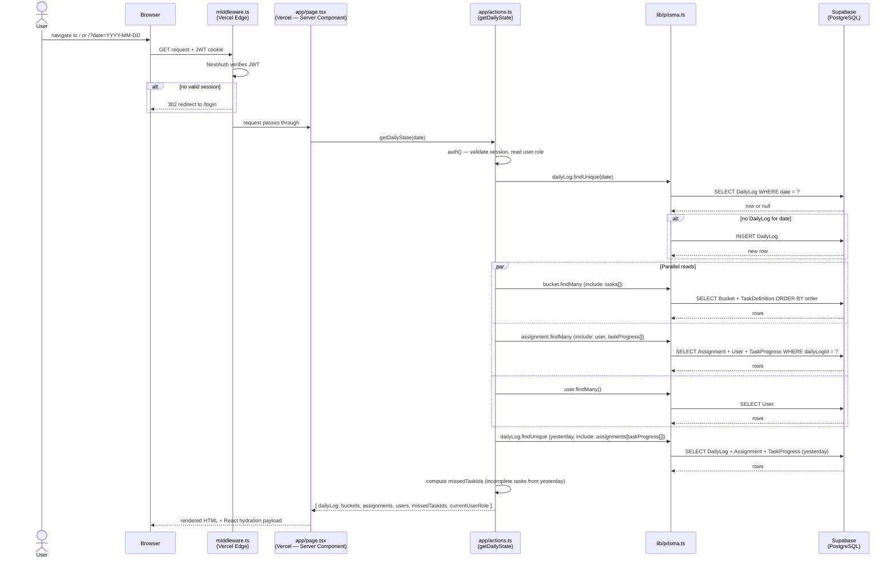
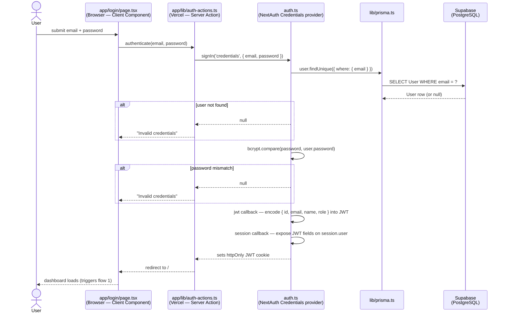
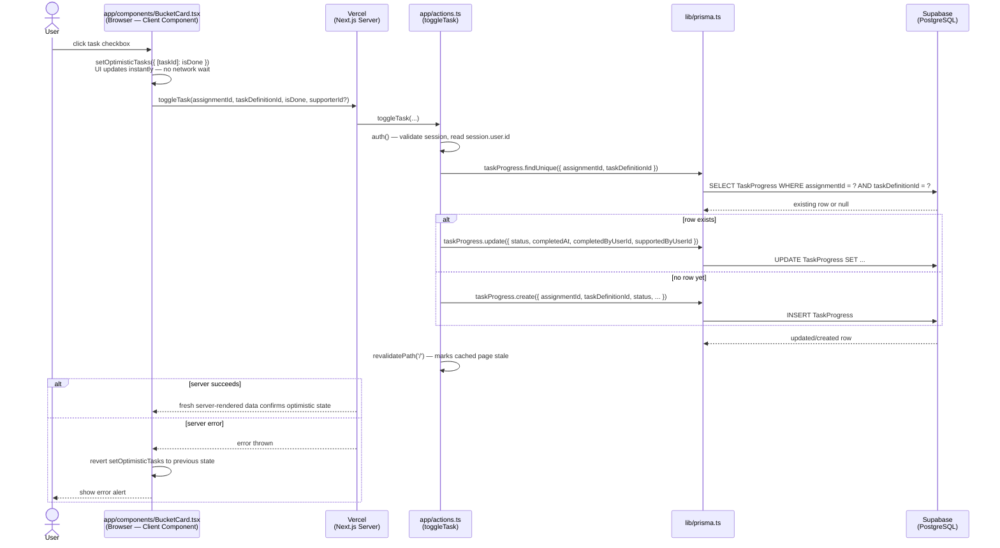
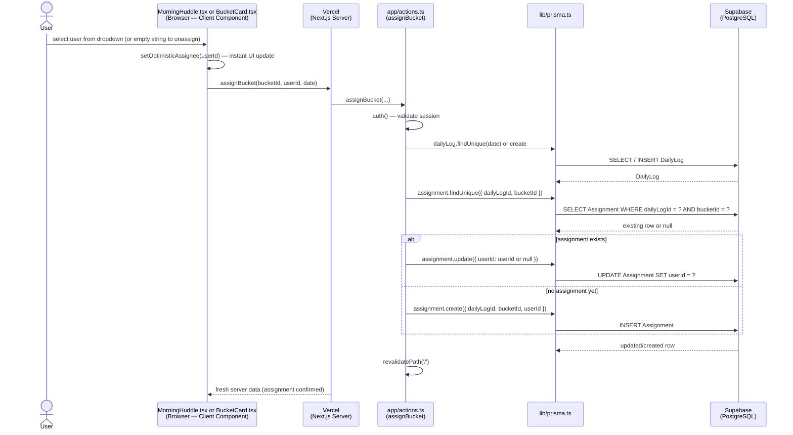
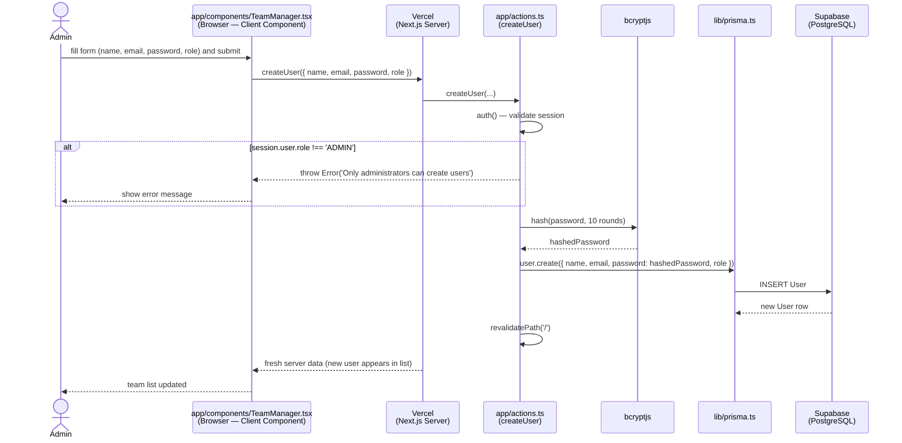
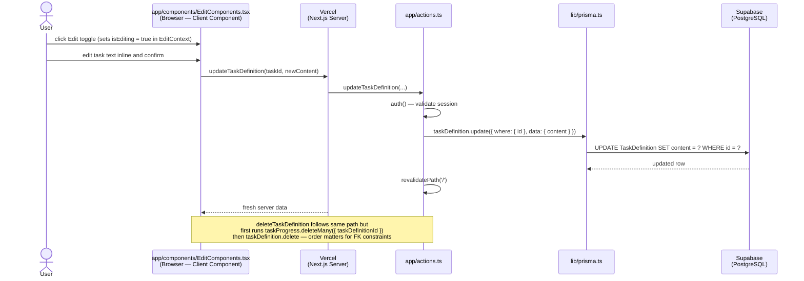

# Lotion — Developer Guide

A ramp-up reference for developers adding features to or maintaining the Lotion daily progress tracker.

---

## What is Lotion?

Lotion is a team task tracker built around the concept of **daily bucket assignments**. Each day, an admin assigns "buckets" (standing task categories, e.g. "Inbound Support") to individual team members. Each bucket contains a list of tasks whose completion is tracked per-day per-person.

---

## Tech Stack

```
┌──────────────────────────────────────────────────────────────────┐
│                           Lotion Stack                           │
│                                                                  │
│  ┌──────────────┐    ┌──────────────┐    ┌──────────────────┐   │
│  │   Supabase   │    │    Prisma    │    │   Next.js 16     │   │
│  │  PostgreSQL  │◄───│   ORM 5.x   │◄───│  + React 19      │   │
│  │  (the data)  │    │ (the bridge) │    │  (the app)       │   │
│  └──────────────┘    └──────────────┘    └──────────────────┘   │
│         ▲                   ▲                    ▲               │
│    Stores rows &       Schema defines       Server Actions       │
│    constraints         TS types &           call prisma.         │
│    on Supabase         SQL migrations       Components call      │
│    (managed via                             Server Actions.      │
│    Prisma migrate)                                               │
└──────────────────────────────────────────────────────────────────┘
```

| Layer | Technology | Purpose |
|---|---|---|
| Database | [Supabase](https://supabase.com) PostgreSQL | Persistent storage, hosted on AWS eu-west-2 |
| ORM | [Prisma 5](https://www.prisma.io/docs) | Schema definition, migrations, type-safe queries |
| Framework | [Next.js 16](https://nextjs.org/docs) (App Router) | Routing, Server Components, Server Actions |
| UI | [React 19](https://react.dev) | Component model, client interactivity |
| Auth | [NextAuth.js v5 beta](https://authjs.dev) | JWT sessions, email/password via Credentials provider |
| Styling | [Tailwind CSS 4](https://tailwindcss.com/docs) | Utility-first CSS |
| Components | [shadcn/ui](https://ui.shadcn.com) + [Radix UI](https://www.radix-ui.com) | Accessible component primitives |
| Icons | [Lucide React](https://lucide.dev) | Icon library (icons referenced by name string in DB) |
| Deployment | [Vercel](https://vercel.com) | Hosting and CI/CD |

---

## Local Development Setup

### Prerequisites

- Node.js 18+
- Docker (for local PostgreSQL, optional if using Supabase directly)
- A Supabase project with connection strings

### First-time setup

```bash
git clone <repo>
cd lotion-react
npm install                      # also runs `prisma generate` via postinstall hook

cp .env.example .env.local       # fill in DATABASE_URL, NEXTAUTH_SECRET, NEXTAUTH_URL

npx prisma migrate deploy        # apply all migrations to your database
npx prisma db seed               # seed with sample users and buckets

npm run dev                      # http://localhost:3000
```

### Environment variables

```bash
# .env.local
DATABASE_URL="postgresql://...@pooler.supabase.com:6543/postgres?pgbouncer=true"
DIRECT_URL="postgresql://...@supabase.com:5432/postgres"   # for migrations (bypasses pgbouncer)
NEXTAUTH_SECRET="..."            # generate: openssl rand -base64 32
NEXTAUTH_URL="http://localhost:3000"
```

`DATABASE_URL` uses the connection pooler (port 6543) for runtime queries. `DIRECT_URL` bypasses the pooler for migrations — Prisma requires a direct connection to run `migrate`. Both are needed in `prisma/schema.prisma`:

```prisma
datasource db {
  provider  = "postgresql"
  url       = env("DATABASE_URL")
  directUrl = env("DIRECT_URL")
}
```

### Useful commands

```bash
npm run dev                                # start dev server
npx prisma studio                          # GUI to browse/edit database rows
npx prisma migrate dev --name <name>       # apply schema change + create migration file
npx prisma generate                        # regenerate TS types after schema change
npx prisma migrate status                  # check if local schema matches database
npx prisma db seed                         # re-seed (safe to re-run)
```

### Test credentials (after seeding)

| Email | Password | Role |
|---|---|---|
| alice@lotion.so | password123 | ADMIN |
| bob@lotion.so | password123 | MEMBER |
| charlie@lotion.so | password123 | MEMBER |
| diana@lotion.so | password123 | MEMBER |

---

## Project Structure

```
lotion-react/
├── app/
│   ├── page.tsx                 # Dashboard — Server Component, fetches state
│   ├── layout.tsx               # Root layout (fonts, providers)
│   ├── actions.ts               # ALL database mutations and reads (Server Actions)
│   ├── globals.css
│   ├── login/
│   │   └── page.tsx             # Login form
│   ├── lib/
│   │   └── auth-actions.ts      # authenticate() server action (called by login page)
│   └── components/
│       ├── BucketCard.tsx        # Core UI: renders one bucket + its tasks
│       ├── MorningHuddle.tsx     # Unassigned buckets panel (today only)
│       ├── DateFilter.tsx        # Calendar date picker → updates URL ?date=
│       ├── UserSwitcher.tsx      # "View as" user dropdown
│       ├── UserContext.tsx       # React context: current user + user list
│       ├── EditComponents.tsx    # Edit mode context + inline edit inputs
│       ├── TeamManager.tsx       # Admin dialog: create/edit/delete users
│       ├── DashboardClientWrapper.tsx  # Provides all contexts to the dashboard
│       └── Icon.tsx             # Dynamic Lucide icon renderer
├── components/
│   └── ui/                      # shadcn/ui components (Button, Card, Dialog, etc.)
│                                # Do not edit these manually — use the shadcn CLI
├── lib/
│   ├── prisma.ts                # Prisma client singleton (import from here, never `new PrismaClient()`)
│   └── utils.ts                 # cn() — Tailwind class merging utility
├── prisma/
│   ├── schema.prisma            # Source of truth for the data model
│   ├── seed.ts                  # Seeds buckets + users
│   └── migrations/              # SQL migration history (commit these)
├── types/
│   └── next-auth.d.ts           # Extends NextAuth types with id and role
├── auth.ts                      # NextAuth config (Credentials provider, JWT callbacks)
├── auth.config.ts               # NextAuth config safe for middleware (no Node.js APIs)
├── middleware.ts                # Route protection — redirects to /login if no session
└── docs/
    └── lotion-developer-guide.md  # You are here
```

---

## Data Model

```
DailyLog (one per date)
  └── Assignment (bucket × user × date)
        └── TaskProgress (completion state per task per assignment)
              └── TaskDefinition (the reusable task template)

Bucket (persistent category, e.g. "Inbound Support")
  └── TaskDefinition (reusable task templates within a bucket)

User
  ├── assignments[]       — buckets assigned to this user on given days
  ├── supportedTasks[]    — TaskProgress rows where this user helped
  └── taskEvents[]        — audit log of completion actions
```

### Models at a glance

```
User               Bucket             DailyLog
─────              ──────             ────────
id (cuid)          id (cuid)          id (cuid)
name               title              date (YYYY-MM-DD, unique)
email (unique)     description?       createdAt
password (hashed)  icon?
role               color
createdAt          order

TaskDefinition     Assignment         TaskProgress
──────────────     ──────────         ────────────
id (cuid)          id (cuid)          id (cuid)
content            dailyLogId ──►     assignmentId ──►
bucketId ──►       bucketId ──►       taskDefinitionId ──►
order              userId ──► User?   status (PENDING|DONE)
                                      completedAt?
                   unique:            completedByUserId ──► User?
                   (dailyLogId,       supportedByUserId ──► User?
                    bucketId)
                                      unique:
                                      (assignmentId,
                                       taskDefinitionId)
```

### Key constraints

- One `DailyLog` per calendar date (`date` is `@unique`)
- One `Assignment` per bucket per day (`@@unique([dailyLogId, bucketId])`)
- One `TaskProgress` per task per assignment (`@@unique([assignmentId, taskDefinitionId])`)
- `Assignment.userId` is nullable — unassigned buckets appear in the Morning Huddle
- Dates are stored as `String` in `YYYY-MM-DD` format (see `DailyLog.date`)

### Tracking task completion

To answer "who completed task X, and when?":

| Field | What it means |
|---|---|
| `Assignment.userId` | Who was *assigned* to the bucket (may not be the one who completed tasks) |
| `TaskProgress.completedByUserId` | The logged-in user who *clicked the checkbox* |
| `TaskProgress.supportedByUserId` | A team member who *helped* (domain concept, optional) |
| `TaskProgress.completedAt` | Timestamp of the last completion toggle |
| `TaskEvent` (if added) | Full audit log — every toggle with actor and timestamp |

---

## Sequence Diagrams

These diagrams trace data through the full stack — Browser → Vercel (Next.js) → Prisma → Supabase — for each major application flow. Files involved at each step are noted in the participant labels.

### 1. Initial Page Load (`getDailyState`)

Triggered whenever the dashboard renders, including after every `revalidatePath('/')` call.



---

### 2. Authentication (`/login`)



---

### 3. Task Toggle with Optimistic Update (`toggleTask`)

The most frequent write operation. The UI updates immediately before the server responds.



---

### 4. Bucket Assignment (`assignBucket`)

Triggered from the Morning Huddle (unassigned buckets) or the assignee dropdown on a BucketCard.



---

### 5. User Creation — Admin Only (`createUser`)



---

### 6. Edit Mode Operations (`updateBucket`, `updateTaskDefinition`, `deleteTaskDefinition`)

These share the same pattern — shown here as `updateTaskDefinition` for conciseness.



---

## Authentication & Authorisation

### How auth works

1. User submits email + password on `/login`
2. `authenticate()` in `app/lib/auth-actions.ts` calls NextAuth's `signIn('credentials', ...)`
3. NextAuth's `authorize` callback (in `auth.ts`) validates password with `bcrypt.compare`
4. A signed JWT is set as an `httpOnly` cookie
5. `middleware.ts` checks the JWT on every request and redirects to `/login` if absent

### Session in Server Actions

Every Server Action starts with:

```typescript
const session = await auth()
if (!session?.user) throw new Error('Unauthorized')
```

The session object contains `session.user.id`, `session.user.email`, `session.user.name`, and `session.user.role` (extended via `types/next-auth.d.ts`).

### Role checks

```typescript
if (session.user.role !== 'ADMIN') {
    throw new Error('Only administrators can do this')
}
```

Currently only `createUser` is admin-gated. Add the same guard to any action that should be restricted.

---

## Server Actions Pattern

All data reads and writes live in `app/actions.ts`. They are [Next.js Server Actions](https://nextjs.org/docs/app/building-your-application/data-fetching/server-actions-and-mutations): async functions marked `'use server'` that run on the server but can be called directly from React components.

### Anatomy of a Server Action

```typescript
export async function myAction(param: string) {
    // 1. Always check auth first
    const session = await auth()
    if (!session?.user) throw new Error('Unauthorized')

    // 2. Optional: role check
    if (session.user.role !== 'ADMIN') throw new Error('Forbidden')

    // 3. Prisma query
    const result = await prisma.someModel.findMany({ where: { ... } })

    // 4. Revalidate the page cache (mutations only — omit for reads)
    revalidatePath('/')

    return result
}
```

### Key actions

| Action | What it does |
|---|---|
| `getDailyState(date)` | Fetches everything needed to render the dashboard for a date |
| `assignBucket(bucketId, userId, date)` | Assigns (or unassigns) a bucket to a user for a day |
| `toggleTask(assignmentId, taskDefinitionId, isDone, supporterId?)` | Marks a task done or pending |
| `createTaskDefinition(bucketId, content)` | Adds a task to a bucket |
| `updateTaskDefinition(taskId, content)` | Edits a task's text |
| `deleteTaskDefinition(taskId)` | Removes a task (cascades to progress rows) |
| `updateBucket(bucketId, title)` | Renames a bucket |
| `createUser(data)` | Admin-only: creates a user with a hashed password |
| `updateUser(id, name)` | Updates a user's name |
| `deleteUser(id)` | Deletes a user, unassigns their buckets |

---

## UI Patterns

### Optimistic updates

Mutations that should feel instant (checkbox ticks, assignment changes) use React's `useOptimistic` to update the UI before the server responds, then revert on error:

```typescript
// In BucketCard.tsx
const [optimisticTasks, setOptimisticTasks] = useOptimistic(tasks)

async function handleToggle(taskId: string, isDone: boolean) {
    setOptimisticTasks(prev => ({ ...prev, [taskId]: isDone }))  // instant
    try {
        await toggleTask(assignmentId, taskId, isDone)           // server confirms
    } catch {
        setOptimisticTasks(prev => ({ ...prev, [taskId]: !isDone }))  // revert on error
        alert('Failed to update task')
    }
}
```

### Context providers

Three React contexts are provided by `DashboardClientWrapper.tsx`:

| Context | Hook | What it provides |
|---|---|---|
| `UserContext` | `useUser()` | `currentUser`, `setCurrentUser`, `users[]` |
| `CurrentUserRoleContext` | `useCurrentUserRole()` | `'ADMIN'` or `'MEMBER'` string |
| `EditContext` | `useEditMode()` | `isEditing`, `setIsEditing` |

### Edit mode

Components render extra controls (inline inputs, delete buttons) when `isEditing === true`. The `EditToggle` button in the header toggles this globally. Components check:

```typescript
const { isEditing } = useEditMode()
// then: {isEditing && <DeleteButton />}
```

### Dynamic icons

Bucket icons are stored as Lucide icon name strings in the database (e.g. `"Headphones"`). The `Icon` component resolves them at render time:

```typescript
// Usage: <Icon name={bucket.icon} className="w-4 h-4" />
// Icon.tsx dynamically imports from lucide-react by name string
```

---

## How to Make Common Changes

### Add a field to an existing model

```
1. prisma/schema.prisma    — add the field
2. npx prisma migrate dev --name <descriptive-name>
3. npx prisma generate     (auto-runs after migrate)
4. app/actions.ts          — include the field in relevant queries/mutations
5. component files         — surface the field in the UI
```

### Add a new model (table)

```
1. prisma/schema.prisma    — define the model + relations
2. npx prisma migrate dev --name <name>
3. npx prisma generate
4. app/actions.ts          — add Server Actions to create/read/update/delete
5. components/             — add UI components that call the new actions
```

### Add a new API operation (Server Action)

```
1. app/actions.ts          — add async function with auth check + prisma query
2. component file          — import and call the function
                             use optimistic update if the action should feel instant
```

### Add a new page

```
1. app/<route>/page.tsx    — create Server Component, call getDailyState or a custom action
2. middleware.ts            — protected routes are already covered by the wildcard matcher;
                             add public route exceptions to the matcher config if needed
3. app/layout.tsx           — add navigation link if needed
```

### Add a shadcn/ui component

```bash
npx shadcn@latest add <component-name>   # e.g. npx shadcn@latest add table
# Component is added to components/ui/ — import from there
```

---

## Worked Example: Adding Task Completion Tracking

This walks through a complete feature change — recording exactly who completed each task and when, with a full audit log.

### 1. Schema change (`prisma/schema.prisma`)

Add `completedByUserId` to `TaskProgress` for direct lookup, and a `TaskEvent` table for full history:

```prisma
model User {
  // ...existing fields...
  completedTasks  TaskProgress[] @relation("CompletedBy")
  taskEvents      TaskEvent[]
}

model TaskProgress {
  // ...existing fields...
  completedByUserId  String?
  completedBy        User?    @relation("CompletedBy", fields: [completedByUserId], references: [id])
  events             TaskEvent[]
}

model TaskEvent {
  id             String   @id @default(cuid())
  taskProgressId String
  userId         String
  action         String   // "COMPLETED" | "UNCOMPLETED"
  createdAt      DateTime @default(now())

  taskProgress   TaskProgress @relation(fields: [taskProgressId], references: [id])
  user           User         @relation(fields: [userId], references: [id])
}
```

The `@relation("CompletedBy")` name is required because `TaskProgress` now has two relations to `User` — Prisma needs to tell them apart.

### 2. Migrate

```bash
npx prisma migrate dev --name add_task_completion_tracking
```

### 3. Update `toggleTask` (`app/actions.ts`)

```typescript
export async function toggleTask(
    assignmentId: string,
    taskDefinitionId: string,
    isDone: boolean,
    supporterId?: string
) {
    const session = await auth()
    if (!session?.user) throw new Error('Unauthorized')

    const existing = await prisma.taskProgress.findUnique({
        where: { assignmentId_taskDefinitionId: { assignmentId, taskDefinitionId } }
    })

    const progressData = {
        status: isDone ? 'DONE' : 'PENDING',
        completedAt: isDone ? new Date() : null,
        completedByUserId: isDone ? session.user.id : null,  // who clicked it
        supportedByUserId: supporterId || null,
    }

    const progress = existing
        ? await prisma.taskProgress.update({ where: { id: existing.id }, data: progressData })
        : await prisma.taskProgress.create({ data: { assignmentId, taskDefinitionId, ...progressData } })

    // Append to audit log
    await prisma.taskEvent.create({
        data: {
            taskProgressId: progress.id,
            userId: session.user.id,
            action: isDone ? 'COMPLETED' : 'UNCOMPLETED',
        }
    })

    revalidatePath('/')
}
```

### 4. Expose history via a new action

```typescript
export async function getTaskHistory(taskDefinitionId: string) {
    const session = await auth()
    if (!session?.user) throw new Error('Unauthorized')

    return prisma.taskEvent.findMany({
        where: { taskProgress: { taskDefinitionId } },
        include: {
            user: { select: { id: true, name: true } },
            taskProgress: {
                include: { taskDefinition: { select: { content: true } } }
            }
        },
        orderBy: { createdAt: 'desc' },
    })
}
```

### 5. Update `getDailyState` to include the new relation

```typescript
// In getDailyState, update the assignments query:
taskProgress: {
    include: {
        completedBy: { select: { id: true, name: true } }
    }
}
```

### 6. UI

In `BucketCard.tsx`, display `progress.completedBy?.name` next to a completed task. A history dialog can call `getTaskHistory(taskDefinitionId)` and render a timestamped list.

---

## Deployment

The app deploys automatically via Vercel on push to `main`.

**Environment variables** must be set in the Vercel project dashboard — they are not read from `.env` files in production. Required vars: `DATABASE_URL`, `DIRECT_URL`, `NEXTAUTH_SECRET`, `NEXTAUTH_URL`.

**Database migrations** are not applied automatically on deploy. Run migrations manually against the production Supabase instance before or after deploying schema-dependent code:

```bash
DATABASE_URL="<prod-direct-url>" npx prisma migrate deploy
```

`migrate deploy` (not `migrate dev`) is the correct command for production — it applies pending migrations without interactive prompts or creating new ones.
